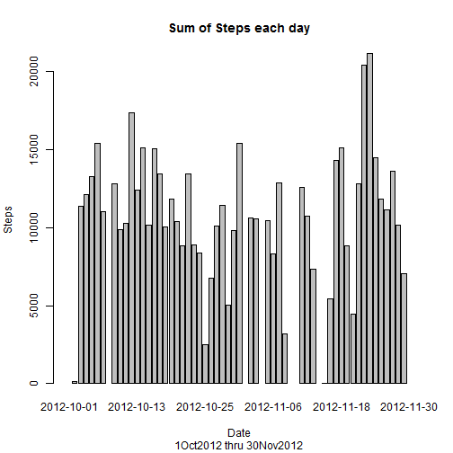
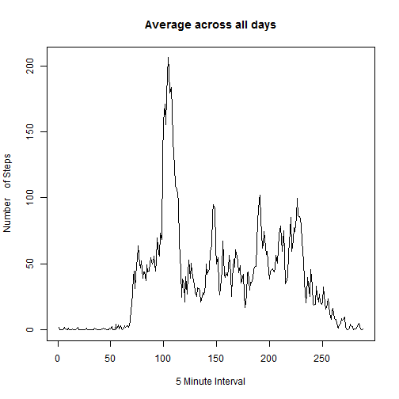
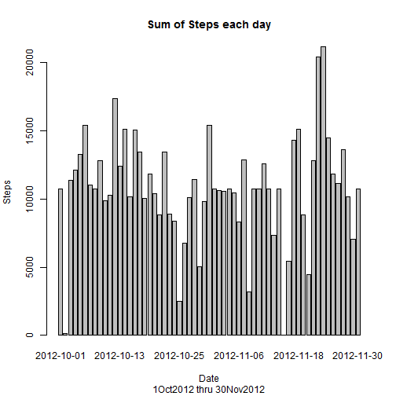
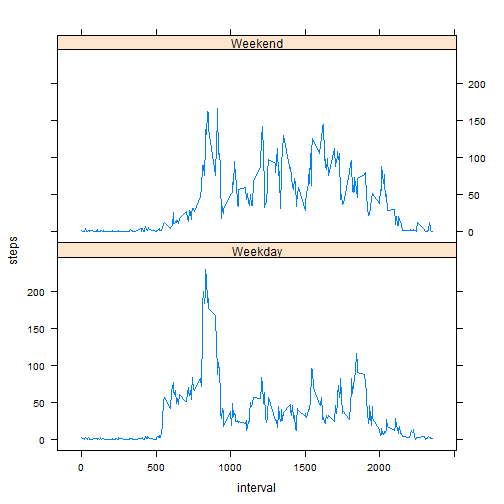

# Reproducible Research: Peer Assessment 1

Note the assignment says the data is already downloaded but if you had to download it, here is the code:

fileUrl <- "http://d396qusza40orc.cloudfront.net/repdata%2Fdata%2Factivity.zip"

download.file(fileUrl, destfile = "./activity.zip")

## Loading and preprocessing the data

Unzip the activity.zip file and read it into R

```r
unzip("./activity.zip")
DT1 <- read.csv("./activity.csv")
DT1$steps <- as.numeric(DT1$steps)
str(DT1)
```

```
## 'data.frame':	17568 obs. of  3 variables:
##  $ steps   : num  NA NA NA NA NA NA NA NA NA NA ...
##  $ date    : Factor w/ 61 levels "2012-10-01","2012-10-02",..: 1 1 1 1 1 1 1 1 1 1 ...
##  $ interval: int  0 5 10 15 20 25 30 35 40 45 ...
```


## What is mean total number of steps taken per day?

Ignore missing values
Make a histogram of the total number of steps taken each day
Note:  barplot gives a better histogram than hist for this exercise so used that.
Calculate and report the mean and median total number of steps taken per day

```r
stepsDailySum <- tapply(DT1$steps, DT1$date, FUN = sum)
barplot(stepsDailySum, ylab = "Steps", xlab = "Date", 
    main = "Sum of Steps each day", sub = "1Oct2012 thru 30Nov2012")
```

 

```r
mean(stepsDailySum, na.rm=TRUE)
```

```
## [1] 10766
```

```r
median(stepsDailySum, na.rm=TRUE)
```

```
## [1] 10765
```

## What is the average daily activity pattern?
Make a time series plot (i.e. type = "l") of the 5-minute interval (x-axis) and the average number of steps taken, averaged across all days (y-axis)
Which 5-minute interval, on average across all the days in the dataset, contains the maximum number of steps?


```r
stepsIntervalMean <- tapply(DT1$steps, DT1$interval, FUN = mean, na.rm = TRUE)
plot(stepsIntervalMean, type = "l", xlab = "5 Minute Interval", 
     ylab = "Number    of Steps", main = "Average across all days")
```

 

```r
which.max(stepsIntervalMean)
```

```
## 835 
## 104
```

## Imputing missing values
Calculate and report the total number of missing values in the dataset (i.e. the total number of rows with NAs)

```r
sum(is.na(DT1))
```

```
## [1] 2304
```
Devise a strategy for filling in all of the missing values in the dataset.
I created a new column in DT1 using stepsIntervalMean.  If Steps was NA replaced Steps with stepsIntervalMean. Then, created a new dataset that is equal to the original dataset but with the missing data filled in.


```r
DT1$stepsIntervalMean <- stepsIntervalMean
  str(DT1)
```

```
## 'data.frame':	17568 obs. of  4 variables:
##  $ steps            : num  NA NA NA NA NA NA NA NA NA NA ...
##  $ date             : Factor w/ 61 levels "2012-10-01","2012-10-02",..: 1 1 1 1 1 1 1 1 1 1 ...
##  $ interval         : int  0 5 10 15 20 25 30 35 40 45 ...
##  $ stepsIntervalMean: num  1.717 0.3396 0.1321 0.1509 0.0755 ...
```

```r
  ##Replace NAs
	newstep <- numeric()
	for (i in 1:nrow(DT1)) {
    		ns <- DT1[i, ]
    		if (is.na(ns$steps)) {
        		steps <- ns$stepsIntervalMean
    		} else {
        	steps <- ns$steps
    		}
    	newstep <- c(newstep, steps)
	}
	DT2 <- DT1
	DT2$steps <- newstep
	str(DT2)
```

```
## 'data.frame':	17568 obs. of  4 variables:
##  $ steps            : num  1.717 0.3396 0.1321 0.1509 0.0755 ...
##  $ date             : Factor w/ 61 levels "2012-10-01","2012-10-02",..: 1 1 1 1 1 1 1 1 1 1 ...
##  $ interval         : int  0 5 10 15 20 25 30 35 40 45 ...
##  $ stepsIntervalMean: num  1.717 0.3396 0.1321 0.1509 0.0755 ...
```


Make a histogram of the total number of steps taken each day and Calculate and report the mean and median total number of steps taken per day. Do these values differ from the estimates from the first part of the assignment? What is the impact of imputing missing data on the estimates of the total daily number of steps?
Note: barplot gives a better histogram than hist for this exercise so uses that


```r
stepsDailySum2 <- tapply(DT2$steps, DT2$date, FUN = sum)
barplot(stepsDailySum2, ylab = "Steps", xlab = "Date", 
    main = "Sum of Steps each day", sub = "1Oct2012 thru 30Nov2012")
```

 

```r
mean(stepsDailySum2, na.rm=TRUE)
```

```
## [1] 10766
```

```r
median(stepsDailySum2, na.rm=TRUE)
```

```
## [1] 10766
```
This shows that imputing the missing values did not really change anything.  The mean stated the same and the median only changed by 1 step.

## Are there differences in activity patterns between weekdays and weekends?
Create a new factor variable in the dataset with two levels - "weekday" and "weekend" indicating whether a given date is a weekday or weekend day.
Make a panel plot containing a time series plot (i.e. type = "l") of the 5-minute interval (x-axis) and the average number of steps taken, averaged across all weekday days or weekend days (y-axis).


```r
DT2$date <- as.Date(DT2$date)
  dayofweek <- weekdays(DT2$date)
	library(lattice)
	typeofday <- vector()
	for (i in 1:nrow(DT2)) {
    		if (dayofweek[i] == "Saturday") {
        		typeofday[i] <- "Weekend"
    		} else if (dayofweek[i] == "Sunday") {
        		typeofday[i] <- "Weekend"
    		} else {
        		typeofday[i] <- "Weekday"
    		}
	}
	DT2$typeofday <- typeofday
	DT2$typeofday <- factor(new_activity$typeofday)
```

```
## Error: object 'new_activity' not found
```

```r
	str(DT2)
```

```
## 'data.frame':	17568 obs. of  5 variables:
##  $ steps            : num  1.717 0.3396 0.1321 0.1509 0.0755 ...
##  $ date             : Date, format: "2012-10-01" "2012-10-01" ...
##  $ interval         : int  0 5 10 15 20 25 30 35 40 45 ...
##  $ stepsIntervalMean: num  1.717 0.3396 0.1321 0.1509 0.0755 ...
##  $ typeofday        : chr  "Weekday" "Weekday" "Weekday" "Weekday" ...
```

```r
	stepsTypeOfDay <- aggregate(steps ~ interval + typeofday, 
		data = DT2, mean)
	str(stepsTypeOfDay)
```

```
## 'data.frame':	576 obs. of  3 variables:
##  $ interval : int  0 5 10 15 20 25 30 35 40 45 ...
##  $ typeofday: chr  "Weekday" "Weekday" "Weekday" "Weekday" ...
##  $ steps    : num  2.251 0.445 0.173 0.198 0.099 ...
```

```r
	xyplot(steps ~ interval | typeofday, stepsTypeOfDay, type = "l", 
		layout = c(1, 2))
```

 

There are differences in weekdays and weekends.  For weekdays there seems to be more activity at the start of each day, this is probably due to getting ready and going to work.  On the weekends, there is activity throughout the day.
